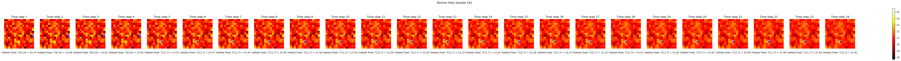
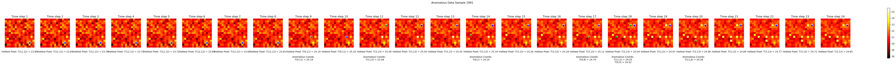

# Detection of quenches of superconducting cables from heat map sequences

## Introduction

We consider a grid of $n\times n$, with $n=15$ magnesium diboride $\rm{MgB}_{2}$ superconducting cables, conducting a current of $18$ kA at $20$ K. The cables maintain their superconducting phase below a critical temperature of $\approx 25$ K, above which they lose their superconducting property (it is said that they _quench_). The cables can be represented as cells in a grid and for each cable the temperature is sampled every hour in cycles of 24 hours (we indicate time steps in the sequence with $t=1,\ldots 24$). Every 24 hours the system is reset in its initial state. 

Despite the cables being isolated and separately cooled, the heat exchange among them is still not vanishing and can be modeled as a heat diffusion equation across the cables grid with a small, known heat diffusion coefficient. Due to the environment in which the cables operate, it can happen that one or more cables suddenly heat, and consequently quench. Their change of temperature propagates through the heat diffusion equation to the matrix of cables and the superconducting phase is recovered only when the heated cables go back to a temperature below $\approx 25$ K. Quenching is detected through current measurements, and it is not inferred by temperature measurements. We are interested in establishing a relation between heat maps and the occurrence of quenches.

## Data description

The input data are sequences of heat maps of the cables grid. As already mentioned, the grid is $15\times 15$ dimensional and the sequences contain $24$ measurements. 

A set of truth labels are also given to build supervised tasks. The first label, with values $0$ and $1$, indicates the category corresponding to no-quenches or at least one quench, respectively. Moreover, for sequences belonging to category $1$, additional labels are available representing the coordinates of the quenches $(t,x,y)$ with $t$ the step in the sequence, and $(x,y)$ the coordinates in the grid.

Available data are $3000$ labeled sequences of heat maps in the form of a python dictionary with the following structure:

```python
data = [
    {
        "sequence": np.array(...),  # A NumPy array of shape (seq_length, grid_size * grid_size) representing the sequence of heat maps
        "label": 0                  # Label 0 indicates a sequence without quenches
    },
    {
        "sequence": np.array(...),  # A NumPy array of shape (seq_length, grid_size * grid_size) representing the sequence of heat maps
        "label": 1,                 # Label 1 indicates a sequence containing at least one quench
        "quench": [
            {
                "step": 10,         # The time step in the sequence at which the anomaly occurred
                "pixel": [2, 3],    # The coordinates of the anomalous pixel
                "temp": 25.32       # The temperature of the anomalous pixel at the time of the anomaly
            },
            ... # Additional quenches
        ]
    }
    ... # Additional sequences
]
```

A pictorial representation of a sample class $0$ sequence is



while a pictorial representation of a sample class $1$ sequence is



Blue pixels represent the hottest cable at each step. Green pixels represent quenching cables.

Data can be downloaded from the following [link](https://drive.google.com/file/d/1eAPddVmDSJTyZRDChdtjYjrW4bya6x_B/view?usp=sharing)

## Objective

1. Build a classifier able to distinguish sequences containing at least one quench from sequences not containing any quench (categories $0$ and $1$)
2. Try to infer the number of quenches in sequences assigned to category $1$
3. (optional) Try to characterize the sequences assigned to category $1$ by predicting the coordinates of the quenching cables (in time, in space, and/or both)

## Suggestions

1. For the same classification task try different architectures exploiting different levels of time and space information.
2. Try to use the additional information on the quenching cables also for solving objective number one.

## Expected Deliverables

A Jupiter notebook containing the following:

1.  Data preprocessing steps (possibly with data visualization)
2.  Model(s) architectures
3.  Training and optimization process
4.  Evaluation of results and comparison of different architectures
5.  Visualizations and explanations of your findings

The notebook should be sufficiently documented (code annotation and explanation of the various steps) and should be delivered to the exam committee at least $5$ days before the oral exam.

There is no restriction on the software; you can use PyTorch, TensorFlow, Keras, or whichever you prefer.

## Evaluation Criteria

- Justification of the choices made in model design and optimization
- Correctness and completeness of the code
- Effectiveness of the model (performance metrics)
- Clarity and thoroughness of the Jupyter notebook documentation
